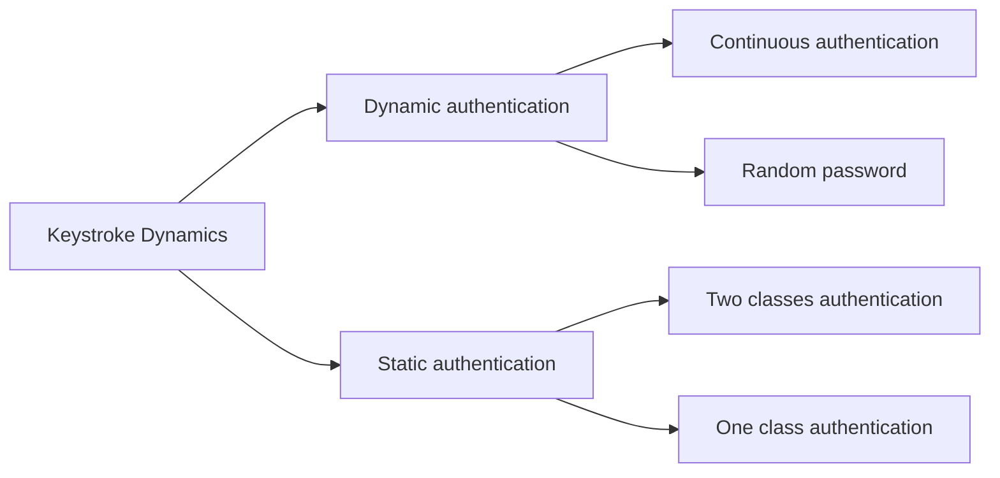
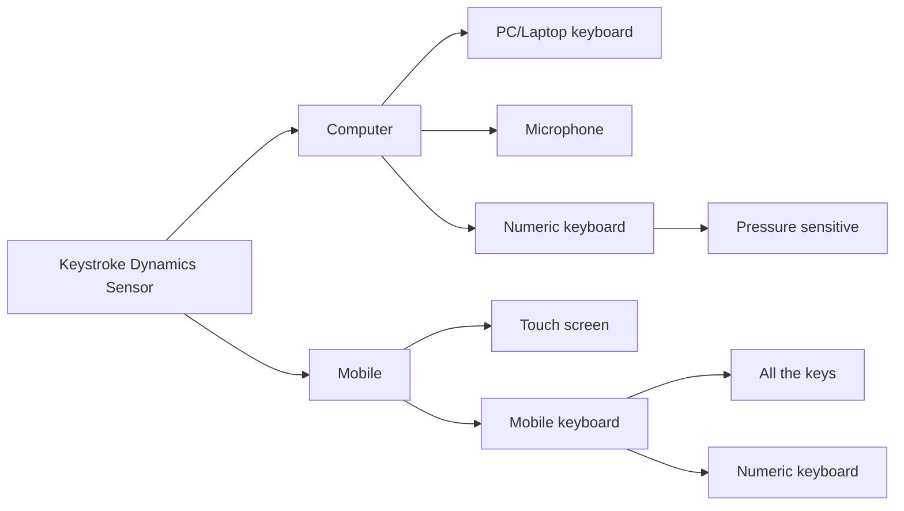
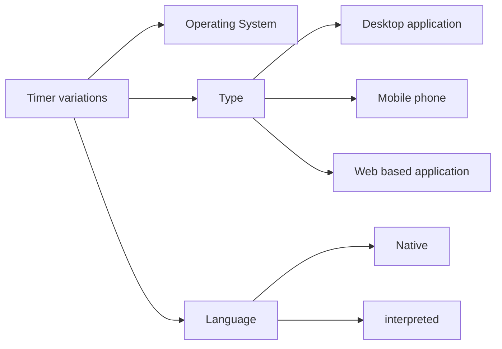

# Keystroke Dynamics Authentication

## Romain Giot, Mohamad El-Abed, Christophe Rosenberger

### 2014

#### [Fig. 2. Topology of keystroke dynamics families](https://hal.archives-ouvertes.fr/hal-00990373/document#page=5)

#### [Fig. 4. Topology of keystroke dynamics sensors of the literature](https://hal.archives-ouvertes.fr/hal-00990373/document#page=9)

#### [Fig. 5. Topology of factors which may impact the accuracy of the timer](https://hal.archives-ouvertes.fr/hal-00990373/document#page=9)

