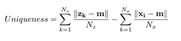
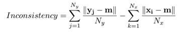
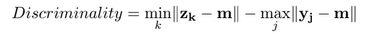

# A Review on the Public Benchmark Databases for Static Keystroke Dynamics

## Keystroke Dynamics System in a static case

Un système "Keystroke Dynamics" est composé de deux modules principaux :

- **Le module d'enregistrement** : Cette phase consiste à effectuer un enregistrement de la signature biométriques d'un utilisateur. Dans cette etape, la chaine de caractères utilisée lors des tests peut etre un mot de passe ou un texte pré-défini (de courte taille si possible) afin de le recopier. Les utilisateurs tapent donc le même mot de passe, à de multiples reprises, dans le but d'obtenir pluseurs acquisitions de données. Ces données récoltées seront donc utilisées afin de créer une référence biométrique propre à l'utilisateur testé, afin de l'identifier.    
Pour chaque entrée enregistrée, des informations concernant les temps de frappes au clavier sont enregistrés. Ces enregistrements pourront donc aider a connaitre les caractéristiques de frappe d'un utilisateur enregistré.

- **Module de vérification**

## Comparaison de valeurs entres les bases de données etudiées

|       Categories       | GREYC |WEBGREYC|DSN2009|BIOCHAVES|GREYC-NISLAB|
|:----------------------:|:-----:|:------:|:-----:|:-------:|:----------:|
|    Numbers of Users    |  133  |  118   |  51   |   30    |    110     |
|Duration bewteen Samples|1 week | 1 week | 1 day |    ?    |     ?      |
|   Number of Sessions   |   5   |   47   |   8   |    ?    |     ?      |
|   Number of Keyboard   |   2   |   1    |   1   |    1    |     1      |
|    Number of Samples   |12/ses | 1/sess |50/ses |   300   |    6600    |

|       Categories       |       Mean       |
|:----------------------:|:----------------:|
|    Numbers of Users    |        88        |
|Duration bewteen Samples|      1 week      |
|   Number of Sessions   |        20        |
|   Number of Keyboard   |    1 keyboard    |
|    Number of Samples   | near 23/sessions |

## Points pouvant impacter les performances d'authentification (Variances entre base de données)

- Durée d'acquisition de la base : Meilleurs résultats sur des courtes periodes, mais non réalistes
- Autorisation ou non, des fautes de frappes : Souvent non autorisé de se tromper. Pour corriger : besoin d'un grand nombre de frappe du mot erroné, sous la bonne forme afin d'entrer l'habitude de frappe du mot.
- Calme de l'endroit : Meilleures perf dans un endroit calme
- Controle de l'acquisition par un opérateur : Histoire de confiance : assurance du respect de régles.
- Mot de passe de test unique pour tous les users : Moins couteux en temps pour une acquisition et plus complexe à mettre en oeuvre. Apprentissage plus rapide de la frappe du password par les users
- OS utilisé : influence sur la précision dans les temps de captures.
- Type de clavier utilisé : Certains types de clavier ont un impact sur les performances, principalement dues à la position des doigts 
- FTAR (Failure to Acquire Rate) : FTAR elevé = FRR (False Rejection Rate) qui augmente. Peut etre un indicateur de la complexité d'un mot de passe.
- Précision du chronométre
- Types d'informations capturées

## Critères de filtres de populations

- Sexe Feminin/Masculin
- Maitrise du clavier
- Droitier/Gaucher
- Age de la personne
- Nombre d'individus impliqués dans l'etude
- Nombre de sessions durant l'etude.
- Nombre d'echantillons par utilisateur

## Critères de selection des mots de passes

- Mot de passe imposés contre mot de passe
- Complexité du mot de passe
- Entropie du mot de passe
- Complexité dans la manière de taper des mots de passes

## Performance d'une base de données
### Respect des propriétés biometriques

Il y a eu des indicateurs présentés afin de verifier la performance de reconnaissance et la qualité des echantillons

- **Unicité :** Il est basé sur la distance des échantillons d'imposteurs par rapport à
les inscriptions (le plus haut est le mieux).

>

- **Incohérence :** Elle est basée sur la similarité entre les échantillons de requête et ceux enregistrés et dépend de la concentration et de la dextérité de l'utilisateur.
(bas est mieux).

>

- **Discriminalité :** Elle est basée sur la distance entre l'échantillon d'imposteur le plus proche de la moyenne des échantillons authentiques et l'autre échantillon authentique (plus cet échantillon est élevé).

>