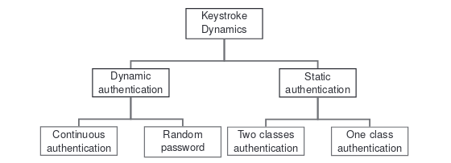
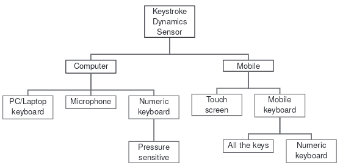

# Categories d'analyses et méthodes d'authentification

## Méthodes d'analyses/authentifications
- 1. **Famille des methodes statiques** :  
On demande à l'utilisateur de taper la même chaine de caractères/même texte plusieurs fois à divers moments, dans le but de batir un modèle de dynamique de touche.     
Le cas le plus courant est l'usage d'un mot de passe connu de la personne testé (son propre mot de passe) ou d'un "*secret commun*".

La chose importante dans cette méthode est que la donnée tapée est connue à l'avance

- 2. **Famille des methodes dynamiques** :     
La personne testé tape un texte indefini et aléatoire. Ici, le texte n'est connu à l'avance et l'analyse sera plus accès sur des habitudes de frappes, décelé durant le test. Les analyses porteront notamment sur les enchainements de deux (Digraphes), ou trois lettres (Trigraphes) communément associées dans la langue d'ecriture (exemple : "*ée*" en Français). Il est habituel que la personne tape un long texte afin de collecter le plus de données et les plus précises possibles.    
L'avantage ici, est que cette méthode est utilisable et vérifiable à tout moment, dès lors qu'une personne  utilise l'ordinateur de test. On peut donc detecter un changement d'utilisateur sur le PC par rapport à une différence d'habitude.

La chose à retenir ici est que le contenu tapé, n'est pas connu à l'avance.

**Voici** donc un schéma illustrant la topologie des familles de dynamiques de touches:     

(*Source : **[https://hal.archives-ouvertes.fr/hal-00990373/document](https://hal.archives-ouvertes.fr/hal-00990373/document)** (Romain Giot, Mohamad El-Abed, Christophe Rosenberger. **Keystroke Dynamics Authentication**.
Biometrics, InTech, chapitre 8, 2011, 978-953-307-618-8. )*)

(*Source : **[https://hal.archives-ouvertes.fr/hal-00990373/document](https://hal.archives-ouvertes.fr/hal-00990373/document)** (Romain Giot, Mohamad El-Abed, Christophe Rosenberger. **Keystroke Dynamics Authentication**.
Biometrics, InTech, chapitre 8, 2011, 978-953-307-618-8. )*)
